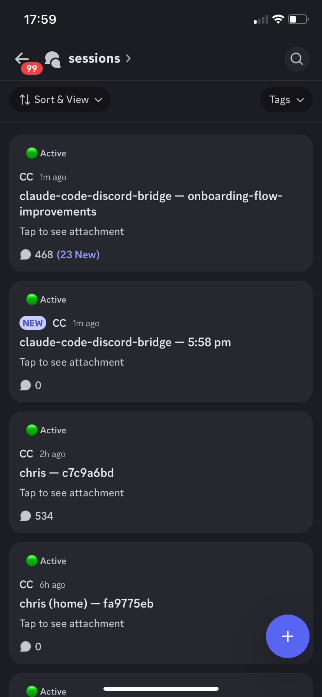

<div align="center">

# Claude Code Discord Bridge

**Control Claude Code from your phone.**

Every running Claude Code instance on your PC automatically appears in Discord.
See everything Claude does. Send prompts. Approve permissions. All from your phone.

[](https://github.com/chrismdemian/claude-code-discord-bridge)
[](LICENSE)
[](https://bun.sh)

</div>

<div align="center">

https://github.com/user-attachments/assets/d27c10f2-c6c5-4d2d-9788-62c3f641a2fb

</div>

---

## Install

**Prerequisites:** [Bun](https://bun.sh/docs/installation) and [Claude Code](https://docs.anthropic.com/en/docs/claude-code) v2.1.80+

```bash
claude plugin marketplace add chrismdemian/claude-code-discord-bridge
claude plugin install discord-bridge@claude-code-discord-bridge
```

Then run the setup wizard inside Claude Code:

```
/discord-bridge:setup
```

Paste your Discord bot token when prompted. The wizard walks you through creating a server, configures channels, installs the bridge service, and sets up a `claude-dc` alias. Takes about 2 minutes.

---

## What You Get

Full output mirroring, not just a chat bridge. Every tool call, diff, terminal output, and file read appears in Discord, formatted for mobile.

<div align="center">

</div>

| Feature | Description |
|---------|-------------|
| **Auto-discovery** | Bridge finds all running Claude Code instances automatically |
| **Forum post per session** | Each session gets its own post, auto-named, auto-tagged by status |
| **Rich diffs** | File edits shown with syntax-highlighted diff formatting |
| **Terminal output** | Bash commands and output, long results attached as files |
| **Permission buttons** | Approve or deny tool calls from your phone with one tap |
| **Reaction shortcuts** | React with ✅ to approve, ❌ to deny, ⏸️ to interrupt |
| **Cost tracking** | Token usage, cost, model, and duration on every response |
| **Smart notifications** | Only pings you when Claude actually needs input |
| **Plan mode** | See plans as structured text, reply to approve |
| **File drops** | Drop an image or file in Discord and Claude receives it |
| **Dashboard** | Pinned embed showing all active sessions at a glance |
| **Multi-instance** | Multiple simultaneous sessions, each in its own post |

---

## How It Works

```
 Your PC                              Your Phone
┌──────────────────────────────────┐  ┌──────────────┐
│ Claude Code 1 ── transcript ─┐   │  │              │
│ Claude Code 2 ── transcript ─┤   │  │   Discord    │
│ Claude Code 3 ── transcript ─┤   │  │              │
│                              │   │  │  #sessions   │
│ Bridge Service ◄─────────────┘   │  │  ├── fix-bug │
│  ├─ Discord bot ◄── internet ──────►│  ├── api-v2  │
│  ├─ Transcript tailer            │  │  └── tests   │
│  └─ Hook receiver                │  │              │
│                                  │  │  #dashboard  │
└──────────────────────────────────┘  └──────────────┘
```

Two components:

1. **Plugin**: lightweight MCP server running inside Claude Code. Handles input (Discord to Claude) via the Channels system.
2. **Bridge Service**: persistent process on your PC. Watches for sessions, tails transcripts, formats output for Discord. Stays alive when Claude Code exits.

---

## Setup

### 1. Create a Discord Bot

Go to [discord.com/developers](https://discord.com/developers/applications), create a New Application, go to **Bot**, and copy the token.

Enable these intents under Bot settings:
- [x] Server Members Intent
- [x] Message Content Intent

### 2. Install and Configure

```bash
# Install the plugin
claude plugin marketplace add chrismdemian/claude-code-discord-bridge
claude plugin install discord-bridge@claude-code-discord-bridge
```

Then run the setup wizard inside Claude Code:

```
/discord-bridge:setup
```

Paste your bot token when prompted. The wizard walks you through adding the bot to a Discord server, then:
- Sets up forum channel, dashboard, and alerts channels
- Creates webhooks and configures the bridge
- Installs the bridge service via pm2
- Sets up the `claude-dc` shell alias

### 3. Start

Open a new terminal and start Claude Code with the channel plugin enabled:

```bash
claude-dc
```

The setup wizard creates this alias for you. Every session you start with `claude-dc` will automatically appear as a forum post in Discord. All Claude Code flags work normally (e.g. `claude-dc --dangerously-skip-permissions`).

> **Note:** You'll see a "Loading development channels" warning on startup. This is normal. Channels is a research preview feature and this plugin isn't on Anthropic's approved allowlist yet. Select "I am using this for local development" to continue.

---

## Commands

### Discord slash commands

These are native Discord commands registered by the bot:

```
/sessions    List all active sessions with status and cost
/status      Show current session details (run inside a session post)
/cost        Token usage and cost breakdown
/stop        Interrupt Claude mid-task
/screenshot  Request a Playwright screenshot
/compact     Toggle compact/verbose mode
/archive     Archive the current session post
/resume      Resume an archived session by ID
```

### Text passthrough

Any message you type in a session post is sent directly to Claude Code. This includes Claude Code commands, just type them as regular messages:

```
/plan     /commit     /compact     /clear     /help
```

### Buttons and reactions

- Permission requests show **Allow** and **Deny** buttons inline
- React to permission embeds with ✅ or ❌ as an alternative to buttons
- React with ⏸️ on any message to interrupt Claude

---

## Requirements

- [Bun](https://bun.sh) v1.0+ runtime
- [Claude Code](https://docs.anthropic.com/en/docs/claude-code) v2.1.80+ (requires Channels capability)
- [pm2](https://pm2.keymetrics.io) process manager (`npm install -g pm2`)
- Discord account and a [bot token](https://discord.com/developers/applications)

---

## Troubleshooting

| Symptom | Cause | Fix |
|---------|-------|-----|
| Sessions not appearing in Discord | Bridge service not running | `pm2 status` then `pm2 start discord-bridge` |
| Can't send prompts from Discord | Session is read-only (no channel plugin) | Start Claude Code with `claude-dc` (the alias created during setup) |
| Bot shows offline | Invalid token or service stopped | Check `.env` token, restart with `pm2 restart discord-bridge` |
| Permission buttons don't work | Plugin cache out of sync | Re-run `/discord-bridge:setup` or reinstall the plugin |
| Duplicate forum posts on restart | Bridge lost track of existing posts | Posts self-heal by reusing posts matching session IDs |

---

## FAQ

**Does this work across multiple PCs?**
No. The bridge service runs on one PC and watches local Claude Code sessions. Each PC needs its own bridge instance.

**Can other people in the Discord server control my Claude?**
No. Only the server owner can send prompts, approve permissions, and use slash commands. Everyone else is view-only.

**Does it cost anything beyond Claude usage?**
No. Discord bots are free. The bridge runs locally on your PC.

**What if my PC goes to sleep?**
Sessions pause. When your PC wakes up, the bridge reconnects and picks up where it left off. pm2 ensures the bridge restarts automatically.

**Windows or Mac?**
Both. The bridge handles platform differences automatically (e.g., `taskkill` on Windows vs `SIGINT` on Unix).

---

## Architecture

Built on Anthropic's **Channels** system, the MCP capability that lets external services push messages into Claude Code sessions.

**Output** uses transcript tailing. Claude Code writes session transcripts as JSONL files synchronously, making them a reliable real-time data source. The bridge tails these files and formats each entry for Discord.

**Input** uses the Channel plugin's notification capability to inject Discord messages directly into the Claude Code conversation.

<details>
<summary>Technical details</summary>

- **Transcript path:** `~/.claude/projects/{encoded-path}/{session-id}.jsonl`
- **Session discovery:** PID files at `~/.claude/sessions/{pid}.json`, watched with chokidar
- **Permission relay:** MCP server declares `claude/channel/permission` capability, bridge posts embeds with buttons, verdicts flow back through the relay
- **Notification tiers:** PING (permission requests, errors), VISIBLE (status changes), SILENT (internal operations)
- **Rate limiting:** Discord webhook limit is 5 req/2s. The bridge batches messages and uses embeds (4096 char limit vs 2000 for regular messages)

</details>

---

## Contributing

Contributions welcome. See [CONTRIBUTING.md](CONTRIBUTING.md) for guidelines.

```bash
# Clone and install
git clone https://github.com/chrismdemian/claude-code-discord-bridge.git
cd claude-code-discord-bridge
bun install

# Run the bridge in dev mode (hot reload)
bun run dev

# In another terminal, run Claude Code with the plugin
claude --dangerously-load-development-channels plugin:discord-bridge@claude-code-discord-bridge
```

You'll need a Discord bot token and test server. See [Setup](#setup) above.

---

## License

Apache 2.0. See [LICENSE](LICENSE).

---

<div align="center">

**Built with Claude Code, for Claude Code users.**

[Report a Bug](https://github.com/chrismdemian/claude-code-discord-bridge/issues) · [Request a Feature](https://github.com/chrismdemian/claude-code-discord-bridge/issues)

</div>
